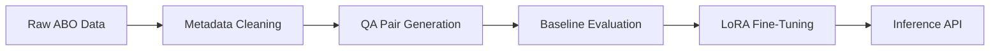

# VR Project-2 by: RishitaPatel_MS2024016, AnweshNayak_MS20224003, AshashreeSarma_MS2024005
## Introduction
This project entails development of a Visual Question Answering (VQA) system for e-commerce products using the Amazon Berkeley Objects (ABO) dataset. 

Project Flow:

Through two systematic iterations, we improved data quality and model performance while adhering to 7B parameter and free-tier GPU constraints.


## Repository Structure
```
VR_Project2/
└── Curated Dataset/
├── Model Weights/
├── MS2024016/
├── Report/
└── Training and Evaluation Scripts/
```
As per the deliverables mentioned in the problem statement document, we have created a comprehensive report of the project as well as provided Inference Script in the namesake folder. 
Note: This readme file only provides an overview of the work done. Please check the attached report for getting in detail information about the project.


## Methodology

### Iteration 1: Foundational Implementation

#### Data Curation
- Retained raw multilingual entries from ABO dataset
- Non-uniform category distribution (bias toward certain categories)
- Basic question templates:
  - "What is the product type?"
  - "What color is this item?"
- Randomly sampled a subset of ABO dataset 
- QA pairs generation using Gemini 2.0 Flash API (3 pairs per datapoint)

#### Baseline Evaluation 


| Model        | Accuracy | Precision (M) | Recall (M) | F1 Score (M) | BERT Precision | BERT Recall | BERT F1 | BARTScore |
|--------------|----------|---------------|------------|--------------|----------------|-------------|---------|-----------|
| ViLT         | 0.2777   | 0.0510        | 0.0585     | 0.0452       | 0.6376         | 0.6286      | 0.6314  | -5.4490   |
| BLIP         | 0.3652   | 0.0465        | 0.0497     | 0.0426       | 0.5334         | 0.4979      | 0.5120  | -5.6331   |


#### Fine-Tuning

| Model        | Accuracy | Precision (M) | Recall (M) | F1 Score (M) | BERT Precision | BERT Recall | BERT F1 | BARTScore |
|--------------|----------|---------------|------------|--------------|----------------|-------------|---------|-----------|
| ViLT         | 0.6231   | 0.3336        | 0.3432     | 0.3159       | 0.8163         | 0.8141      | 0.8143  | -3.8496   |
| BLIP         | 0.4652   | 0.1237        | 0.1465     | 0.1144       | 0.5046         | 0.5409      | 0.5187  | -5.3818   |


Limitations:
- No answer normalization
- Overfitting on dominant categories
- Semantic inconsistency in predictions

---

### Iteration 2: Enhanced Pipeline

#### Improved Data Curation

- Extracted English-only data from the ABO dataset

- Column Selection: Kept only VQA-relevant fields:
  - item_name
  - bullet_point 
  - color 
  - node 

- Balanced Sampling:
  - 100 samples per product category (where available)
  - Minimum 5 samples for rare categories

- Answer Standardization:

| Raw Answer | Normalized Form |
|------------|------------------|
| "two"      | "2"              |
| "navy"     | "#000080"        |
| "yes"      | "True"           |


#### Fine-Tuning

##### ViLT+LoRA Configuration

- LoRA Parameters:
  - Rank: 8
  - Target Modules: Query/Value projections
  - Alpha: 32
  - Dropout: 0.1

- Training Protocol:
  - Phase 1 (Epochs 1–3):
    - Frozen backbone
    - Train only classifier + LoRA adapters
    - Learning rate: 5e-5
  
  - Phase 2 (Epochs 4–10):
    - Unfreeze top 3 transformer layers
    - Learning rate: 1e-5
    - Add gradient clipping (max norm=1.0)

- Key Enhancements:
  - Dynamic answer embedding lookup
  - Question-type weighted loss function
  - FP16 mixed-precision training

Performance Comparison

| Model             | Accuracy | F1 Score | BERTScore | Inference Time |
|------------------|----------|----------|-----------|----------------|
| Iteration 1 BLIP | 51.43%   | 0.243    | 0.524     | 2.6s           |
| Iteration 2 ViLT | 56.92%   | 0.552    | 0.763     | 3.2s           |
