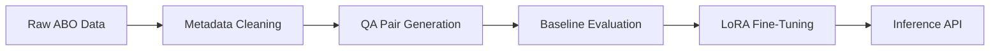

# VR Project-2  
**By: Anwesh Nayak (MS20224003), Ashashree Sarma (MS2024005), Rishita Patel (MS2024016)**

## 🧠 Introduction

This project entails the development of a **Visual Question Answering (VQA)** system tailored for **e-commerce products**, using the **Amazon Berkeley Objects (ABO)** dataset. The goal was to build a multimodal pipeline that can answer product-related visual questions through a combination of curated metadata, images, and fine-tuned vision-language models.

Project Flow:

Through two systematic iterations, we improved data quality and model performance while adhering to 7B parameter and free-tier GPU constraints.

## Repository Structure
```
├── Data Curation/
│   ├── EDA_Data.ipynb
│   ├── Generate VQA through API.ipynb
│   ├── metadata_extraction_FINAL.ipynb
│   ├── VQA.csv
│   └── VQA_dict.json
├── MS2024003/
│   ├── downloader.py
│   ├── inference.py
│   └── requirements.txt
├── Report/
│   ├── images/
│   │   ├── Most common categories.png
│   │   ├── most common colors.png
│   │   ├── most common questions.png
│   │   ├── Top answers for question.png
│   │   └── Top Question Start Patterns.png
│   └── Report.pdf
└── VLMs/
    ├── BLIP_Baseline_Finetune.ipynb
    └── VILT_Baseline_Finetune.ipynb
```
As per the deliverables mentioned in the problem statement document, we have created a comprehensive report of the project as well as provided Inference Script in the namesake folder. 
Note: This readme file only provides an overview of the work done. Please check the attached report for getting in detail information about the project.

##Exploratory Data Analysis (EDA)

To gain insights from the curated dataset, we performed an initial exploratory analysis. Here are key visualizations derived from our VQA pairs:

### Most Common Categories


### Most Common Colors


### Most Common Questions


### Top Answers for a Question


### Top Question Start Patterns


These insights helped refine our prompt engineering strategy and provided evidence for balancing samples across categories and attributes.


## Methodology


### Data Curation
We adopted a two-stage iterative approach to curate a high-quality VQA dataset.

#### Iteration 1: 

- Retained raw multilingual entries from ABO dataset
- Non-uniform category distribution (bias toward certain categories)
- Basic question templates:
  - "What is the product type?"
  - "What color is this item?"
- Randomly sampled a subset of ABO dataset 
- QA pairs generation using Gemini 2.0 Flash API (3 pairs per datapoint)
- 

#### Iteration 2: 


- Extracted English-only data from the ABO dataset
  
- Column Selection: Kept only VQA-relevant fields:
  - item_name
  - bullet_point 
  - color 
  - node
    
- Balanced Sampling:
  - 100 samples per product category (where available)
  - Minimum 5 samples for rare categories

- Answer Standardization:

| Raw Answer | Normalized Form |
|------------|------------------|
| "two"      | "2"              |
| "navy"     | "#000080"        |
| "yes"      | "True"           | 

#### Final Prompt - Inspired from Chain of Thoughts (Used with Gemini API):

 
```
    Based on the product present in the image and producnt information present in the metadata related to the image provided generate multiple choice questions.
    These questions should be answerable purely based on the image and visual features, the metadata should be strictly used as a helping aid to generate the questions.
    If metadata isn't in english then translate it to english then use the information.
    Each question should also provide exactly 4 options (1 correct + 3 plausible distractors).
    All the questions should be in english.
    Stricly follow the rules mentioned above.
    Follow the strcuture below to generate questions.

    1.  A mandatory question about product identification.
        - Template: "What is this product?"
        - Information about this queston can be found in the metadata provided or else you can generate it based on the image.
        - Options: [correct_product_type, 3 similar but incorrect types from same high-level category]

    2.  A mandatory question about product category..
        - Template: "Which category best describes this product?"
        - Information about this queston can be found in the metadata provided or else you can generate it based on the image.
        - Options: [correct category, 3 related but incorrect category]

    3.  A question about dominant color.
        - Template: "What is the primary color of this [product_type]?"
        - Information about this queston can be found in the metadata provided or else you can generate it based.
        - If sufficent information isn't present about the product or there's amiguity in ddeciding the exact answer drop the question.
        - Options: [correct_color, 3 common alternate colors for this product type which aren't present in the given image or they aren't the dominant colour]

    4.  A question about product description.
        - Template: Generate a relevant question based on the information provided in the meta data which can be striclty be answered visually from the image.
        - Information about this queston can be found in the metadata provided or else you can generate it based.
        - If sufficent information isn't present about the product or there's amiguity in ddeciding the exact answer drop the question.
        - Options: [correct option, 3 plausible alternatives]

    5. Another relevant visual question similar to the above questions.
        - Template: Question can be about anything based on the visual features of the product present in the image,
        - Information about this queston can be found in the metadata provided or else you can generate it based.
        - If sufficent information isn't present about the product or there's amiguity in ddeciding the exact answer drop the question.
        - Options: [correct option, 3 plausible alternatives]

    6. Another relevant visual question similar to the above questions.
        - Template: Question can be about anything based on the visual features of the product present in the image,
        - Information about this queston can be found in the metadata provided or else you can generate it based.
        - If sufficent information isn't present about the product or there's amiguity in ddeciding the exact answer drop the question.
        - Options: [correct option, 3 plausible alternatives]

    {{row_data}}

    Your response should be a json object with the questions as keys and values should be another dictionary with keys as correct option and plausible options.
    Strict Rules
    - For binary features: Use ["yes", "no", "partially", "not visible"] as shown above.
    - Answers shoud be single words or very short phrases (1-3 words max).
    - Subjective questions are prohibited (e.g., "Is this attractive?").
    - Output should be in english language.
    - Strictly follow the prescrived output format.
```
    

### Baseline Evaluation 

We evaluated two pre-trained vision-language models without any fine-tuning:

- ViLT (dandelin/vilt-b32-mlm)

- BLIP (Salesforce/blip-vqa-base)


| Model        | Accuracy | Precision (M) | Recall (M) | F1 Score (M) | BERT Precision | BERT Recall | BERT F1 | BARTScore |
|--------------|----------|---------------|------------|--------------|----------------|-------------|---------|-----------|
| ViLT         | 0.2777   | 0.0510        | 0.0585     | 0.0452       | 0.6376         | 0.6286      | 0.6314  | -5.4490   |
| BLIP         | 0.3652   | 0.0465        | 0.0497     | 0.0426       | 0.5334         | 0.4979      | 0.5120  | -5.6331   |


### Fine-Tuning with LoRA

##### BLIP+LoRA Configuration

**•⁠ LoRA Parameters:**
- **Rank:** 16  
- **Target Modules:** `query`, `value`  
- **Alpha:** 32  
- **Dropout:** 0.1  

**•⁠ Training Protocol:**
- **Dataset:** VQA-style, 60% sample used  
- **Split:** 80% training, 20% validation  
- **Batch Size:** 8  
- **Backbone Model:** `Salesforce/blip-vqa-base`  
- **LoRA Framework:** Integrated using `peft.LoraConfig`  

> _Note: Epoch-wise protocol was not explicitly defined in the notebook. This setup assumes standard LoRA fine-tuning with PEFT._

**•⁠ Key Enhancements (Implied):**
- LoRA applied to transformer attention (`query`, `value`) layers  
- Mixed-precision likely (FP16 assumed, though not explicitly shown)  
- BLIP processor and model from HuggingFace  
- Image-question-answer mapping from JSON used for dataset creation  


##### ViLT+LoRA Configuration

**•⁠ LoRA Parameters:**
- **Rank:** *Not explicitly defined*  
- **Target Modules:** *LoRA not applied in this notebook*  
- **Alpha:** *N/A*  
- **Dropout:** *Not applied via LoRA*

> **Note:** This configuration does not implement LoRA. Instead, it directly fine-tunes a pretrained ViLT model (`dandelin/vilt-b32-mlm`) for multiple-choice question answering.

**•⁠ Training Protocol:**
- **Dataset:** Custom VQA dataset loaded from JSON (with image-question-answer mapping)
- **Split:** 70% train, 15% validation, 15% test
- **Batch Size:** 8
- **Backbone Model:** `dandelin/vilt-b32-mlm`
- **Model Used:** `ViltForQuestionAnswering` and a custom `ViltForMultipleChoice` wrapper
- **Optimizer:** AdamW
- **Learning Rate:** `5e-5`
- **Epochs:** 3
- **Device:** GPU if available, else CPU

**•⁠ Key Enhancements:**
- Custom dataset wrapper for multiple-choice questions
- `ViltProcessor` used to encode both image and text
- Fine-tuning includes a classification head added on top of pooled ViLT output
- CrossEntropyLoss used for training


| Model        | Accuracy | Precision (M) | Recall (M) | F1 Score (M) | BERT Precision | BERT Recall | BERT F1 | BARTScore |
|--------------|----------|---------------|------------|--------------|----------------|-------------|---------|-----------|
| ViLT         | 0.6231   | 0.3336        | 0.3432     | 0.3159       | 0.8163         | 0.8141      | 0.8143  | -3.8496   |
| BLIP         | 0.4652   | 0.1237        | 0.1465     | 0.1144       | 0.5046         | 0.5409      | 0.5187  | -5.3818   |


## Evaluation Metrics

#### Standard:

- Accuracy (exact match)

- F1 Score, Precision, Recall

#### Advanced:

- BERTScore: Measures semantic similarity.

- BARTScore: Text generation quality assessment.

## Inference

A clean inference script (inference.py) is provided. This script loads the fine-tuned model and answers new multiple-choice VQA queries.

## Final Deliverables

✅ Curated VQA Dataset (VQA.csv, VQA_dict.json)

✅ Codebase for data curation, training, evaluation

✅ LoRA fine-tuned models (via HuggingFace PEFT)

✅ Report with insights and visuals (Report.pdf)

✅ Evaluation using standard + advanced metrics

✅ Working inference script for API-style usage

## License

This project is for academic coursework (AIM825, Spring 2025) and adheres to academic integrity policies. All models and datasets used comply with their respective licenses.
