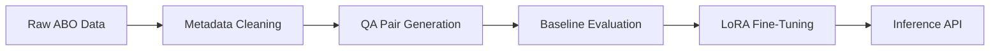

# VR Project-2 by: RishitaPatel_MS2024016, AnweshNayak_MS20224003, AshashreeSarma_MS2024005
## Introduction
This project entails development of a Visual Question Answering (VQA) system for e-commerce products using the Amazon Berkeley Objects (ABO) dataset. 

Project Flow:

Through two systematic iterations, we improved data quality and model performance while adhering to 7B parameter and free-tier GPU constraints.


## Repository Structure
```
VR_Project2/
└── Curated Dataset/
├── Model Weights/
├── MS2024016/
├── Report/
└── Training and Evaluation Scripts/
```
As per the deliverables mentioned in the problem statement document, we have created a comprehensive report of the project as well as provided Inference Script in the namesake folder. 
Note: This readme file only provides an overview of the work done. Please check the attached report for getting in detail information about the project.


## Methodology

### Iteration 1: Foundational Implementation

#### Data Curation
- Retained raw multilingual entries from ABO dataset
- Non-uniform category distribution (bias toward certain categories)
- Basic question templates:
  - "What is the product type?"
  - "What color is this item?"
- Randomly sampled a subset of ABO dataset 
- QA pairs generation using Gemini 2.0 Flash API (3 pairs per datapoint)

#### Baseline Evaluation 

| Model       | Accuracy | Inference Time | 
|-------------|----------|----------------|
| BLIP        | 30%      | 1.02s          | 
| InstructBLIP| 68%      | 6.8s           | 
| CLIP        | 34%      | 0.6s           |
| OWL-ViT     | 29%      | 2.9s           | 
| LiteBLIP    | 72%      | 6.9s           |

#### Fine-Tuning
- Approach: Basic ViLT + LoRA (Rank=4)

| Metric         | Value  |
| -------------- | ------ |
| Loss           | 1.2991 |
| Accuracy       | 0.4617 |
| F1 Score       | 0.6317 |
| BERT Precision | 0.9696 |
| BERT Recall    | 0.9661 |
| BERT F1        | 0.9676 |
| BART Precision | 0.9696 |
| BART Recall    | 0.9661 |
| BART F1        | 0.9676 |


Limitations:
- No answer normalization
- Overfitting on dominant categories
- Semantic inconsistency in predictions

---

### Iteration 2: Enhanced Pipeline

#### Improved Data Curation

- Extracted English-only data from the ABO dataset

- Column Selection: Kept only VQA-relevant fields:
  - item_name
  - bullet_point 
  - color 
  - node 

- Balanced Sampling:
  - 100 samples per product category (where available)
  - Minimum 5 samples for rare categories

- Answer Standardization:

| Raw Answer | Normalized Form |
|------------|------------------|
| "two"      | "2"              |
| "navy"     | "#000080"        |
| "yes"      | "True"           |

#### Baseline Evaluation

| Model                   | Accuracy | Precision | Recall | F1   | BERT-F1 | ROUGE-1 | BLEU  | METEOR | Avg Time (s) |
|-------------------------|----------|-----------|--------|------|---------|---------|-------|--------|---------------|
| clip-vit-base-patch32   | 0.50     | 0.36      | 0.32   | 0.33 | 0.98    | 0.60    | 0.55  | 0.39   | 0.33          |
| blip2-flan-t5-xl        | 0.40     | 0.25      | 0.25   | 0.25 | 0.96    | 0.50    | 0.45  | 0.25   | 2.04          |
| clip-vit-base-patch32   | 0.50     | 0.36      | 0.32   | 0.33 | 0.98    | 0.60    | 0.55  | 0.39   | 0.33          |
| clip-vit-large-patch14  | 0.30     | 0.19      | 0.19   | 0.19 | 0.93    | 0.30    | 0.30  | 0.28   | 0.36          |
| blip2-opt-1.7b          | 0.20     | 0.09      | 0.13   | 0.10 | 0.96    | 0.20    | 0.20  | 0.10   | 0.52          |
| instructblip-flan-t5-xl | 0.10     | 0.06      | 0.06   | 0.06 | 0.98    | 0.10    | 0.10  | 0.10   | 3.40          |


#### Fine-Tuning

##### ViLT+LoRA Configuration

- LoRA Parameters:
  - Rank: 8
  - Target Modules: Query/Value projections
  - Alpha: 32
  - Dropout: 0.1

- Training Protocol:
  - Phase 1 (Epochs 1–3):
    - Frozen backbone
    - Train only classifier + LoRA adapters
    - Learning rate: 5e-5
  
  - Phase 2 (Epochs 4–10):
    - Unfreeze top 3 transformer layers
    - Learning rate: 1e-5
    - Add gradient clipping (max norm=1.0)

- Key Enhancements:
  - Dynamic answer embedding lookup
  - Question-type weighted loss function
  - FP16 mixed-precision training

Performance Comparison

| Model             | Accuracy | F1 Score | BERTScore | Inference Time |
|------------------|----------|----------|-----------|----------------|
| Iteration 1 BLIP | 51.43%   | 0.243    | 0.524     | 2.6s           |
| Iteration 2 ViLT | 56.92%   | 0.552    | 0.763     | 3.2s           |
