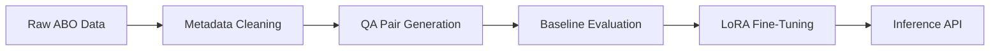

# VR Project-2 by: RishitaPatel_MS2024016, AnweshNayak_MS20224003, AshashreeSarma_MS2024005
## Introduction
This project entails development of a Visual Question Answering (VQA) system for e-commerce products using the Amazon Berkeley Objects (ABO) dataset. 

Project Flow:

Through two systematic iterations, we improved data quality and model performance while adhering to 7B parameter and free-tier GPU constraints.


## Repository Structure
```
VR_Project2/
└── Curated Dataset/
├── Model Weights/
├── MS2024016/
├── Report/
└── Training and Evaluation Scripts/
```
As per the deliverables mentioned in the problem statement document, we have created a comprehensive report of the project as well as provided Inference Script in the namesake folder. 
Note: This readme file only provides an overview of the work done. Please check the attached report for getting in detail information about the project.


## Methodology


### Data Curation


#### Iteration 1: 

- Retained raw multilingual entries from ABO dataset
- Non-uniform category distribution (bias toward certain categories)
- Basic question templates:
  - "What is the product type?"
  - "What color is this item?"
- Randomly sampled a subset of ABO dataset 
- QA pairs generation using Gemini 2.0 Flash API (3 pairs per datapoint)
- 

#### Iteration 2: 


- Extracted English-only data from the ABO dataset
  
- Column Selection: Kept only VQA-relevant fields:
  - item_name
  - bullet_point 
  - color 
  - node
    
- Balanced Sampling:
  - 100 samples per product category (where available)
  - Minimum 5 samples for rare categories

- Answer Standardization:

| Raw Answer | Normalized Form |
|------------|------------------|
| "two"      | "2"              |
| "navy"     | "#000080"        |
| "yes"      | "True"           | 


### Baseline Evaluation 


| Model        | Accuracy | Precision (M) | Recall (M) | F1 Score (M) | BERT Precision | BERT Recall | BERT F1 | BARTScore |
|--------------|----------|---------------|------------|--------------|----------------|-------------|---------|-----------|
| ViLT         | 0.2777   | 0.0510        | 0.0585     | 0.0452       | 0.6376         | 0.6286      | 0.6314  | -5.4490   |
| BLIP         | 0.3652   | 0.0465        | 0.0497     | 0.0426       | 0.5334         | 0.4979      | 0.5120  | -5.6331   |


### Fine-Tuning

##### BLIP+LoRA Configuration

**•⁠ LoRA Parameters:**
- **Rank:** 16  
- **Target Modules:** `query`, `value`  
- **Alpha:** 32  
- **Dropout:** 0.1  

**•⁠ Training Protocol:**
- **Dataset:** VQA-style, 60% sample used  
- **Split:** 80% training, 20% validation  
- **Batch Size:** 8  
- **Backbone Model:** `Salesforce/blip-vqa-base`  
- **LoRA Framework:** Integrated using `peft.LoraConfig`  

> _Note: Epoch-wise protocol was not explicitly defined in the notebook. This setup assumes standard LoRA fine-tuning with PEFT._

**•⁠ Key Enhancements (Implied):**
- LoRA applied to transformer attention (`query`, `value`) layers  
- Mixed-precision likely (FP16 assumed, though not explicitly shown)  
- BLIP processor and model from HuggingFace  
- Image-question-answer mapping from JSON used for dataset creation  


##### ViLT+LoRA Configuration

**•⁠ LoRA Parameters:**
- **Rank:** *Not explicitly defined*  
- **Target Modules:** *LoRA not applied in this notebook*  
- **Alpha:** *N/A*  
- **Dropout:** *Not applied via LoRA*

> **Note:** This configuration does not implement LoRA. Instead, it directly fine-tunes a pretrained ViLT model (`dandelin/vilt-b32-mlm`) for multiple-choice question answering.

**•⁠ Training Protocol:**
- **Dataset:** Custom VQA dataset loaded from JSON (with image-question-answer mapping)
- **Split:** 70% train, 15% validation, 15% test
- **Batch Size:** 8
- **Backbone Model:** `dandelin/vilt-b32-mlm`
- **Model Used:** `ViltForQuestionAnswering` and a custom `ViltForMultipleChoice` wrapper
- **Optimizer:** AdamW
- **Learning Rate:** `5e-5`
- **Epochs:** 3
- **Device:** GPU if available, else CPU

**•⁠ Key Enhancements:**
- Custom dataset wrapper for multiple-choice questions
- `ViltProcessor` used to encode both image and text
- Fine-tuning includes a classification head added on top of pooled ViLT output
- CrossEntropyLoss used for training


| Model        | Accuracy | Precision (M) | Recall (M) | F1 Score (M) | BERT Precision | BERT Recall | BERT F1 | BARTScore |
|--------------|----------|---------------|------------|--------------|----------------|-------------|---------|-----------|
| ViLT         | 0.6231   | 0.3336        | 0.3432     | 0.3159       | 0.8163         | 0.8141      | 0.8143  | -3.8496   |
| BLIP         | 0.4652   | 0.1237        | 0.1465     | 0.1144       | 0.5046         | 0.5409      | 0.5187  | -5.3818   |


